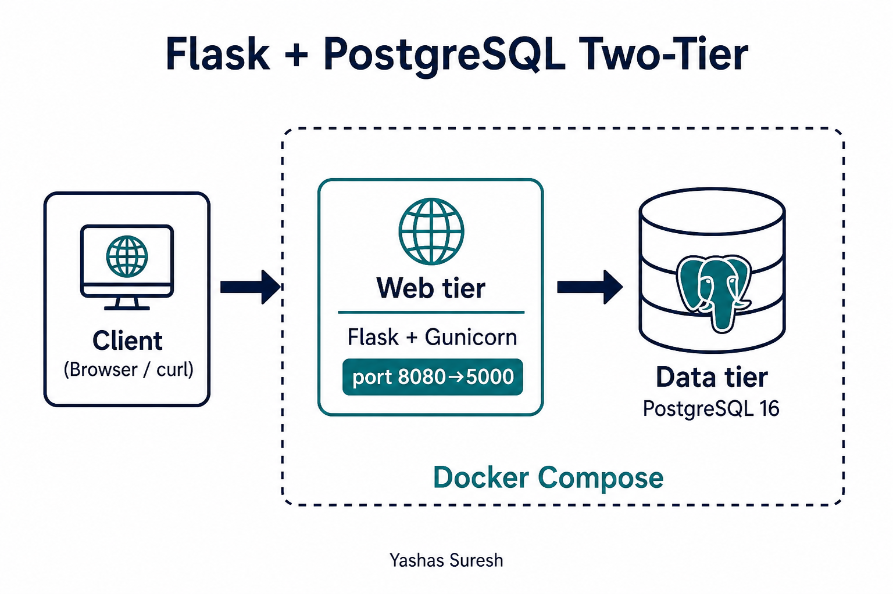
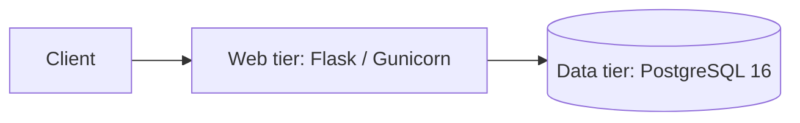
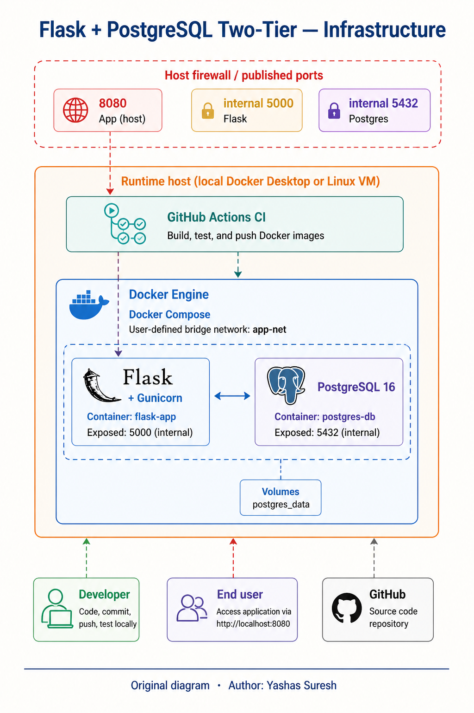
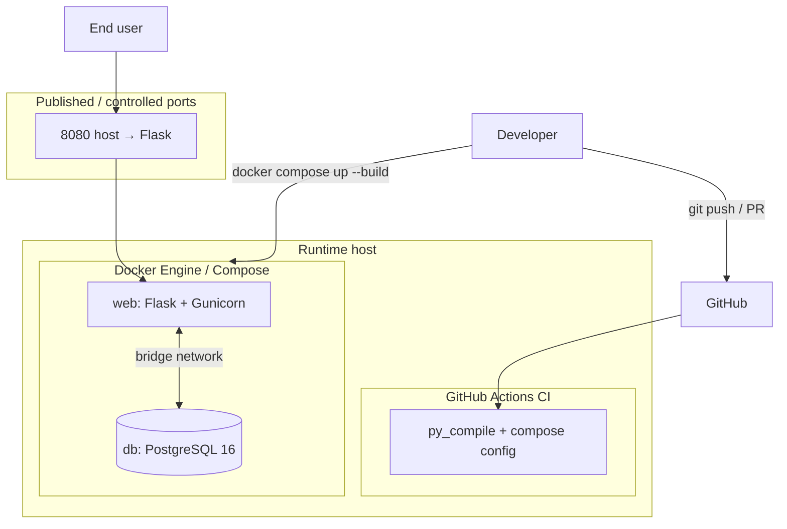
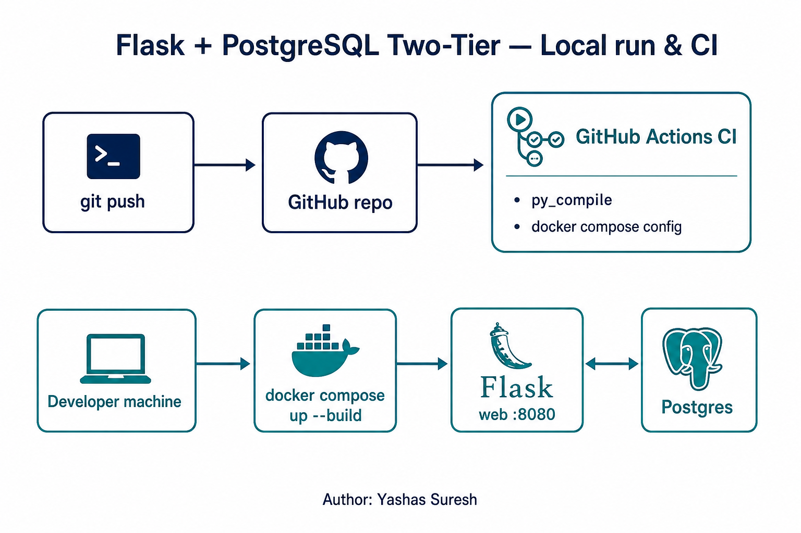
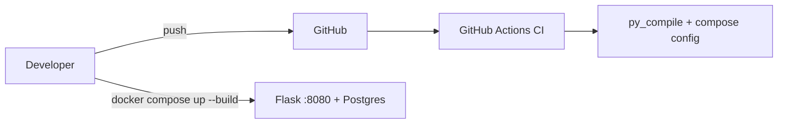

# Flask + PostgreSQL Two-Tier

Original two-tier web application: **Flask** (web) + **PostgreSQL 16** (data).

**Author:** [Yashas Suresh](https://github.com/yashassuresh775)

## Architecture





## Infrastructure



Same layout idea as a classic two-tier DevOps poster (host → ports → containers → CI), redrawn for **this** repo:

| Layer | Their reference idea | Ours |
| --- | --- | --- |
| Edge / ports | Security group: 22 / 8080 Jenkins / 5000 app / 3306 MySQL | Published host port **8080** → container 5000; Postgres stays **internal** on Compose network |
| Compute | Single EC2 (Ubuntu) | Local Docker Desktop / any Linux host |
| App runtime | Docker Engine + bridge network | Docker Compose network (`web` ↔ `db`) |
| Data store | MySQL | **PostgreSQL 16** |
| CI/CD | Jenkins on the same host + GitHub webhook | **GitHub Actions** (`py_compile` + `docker compose config`) |
| Actors | Developer (SSH) + end user (browser) | Developer (`git` / `compose`) + end user (`http://localhost:8080`) |



## Local run & CI





## Requirements

- Docker and Docker Compose

## Run with Docker Compose

```bash
cp .env.example .env
docker compose up --build
```

Open [http://localhost:8080](http://localhost:8080) for the health HTML page.
(Host port **8080** avoids macOS AirPlay often binding to 5000.)

## API examples

Health check:

```bash
curl -s http://localhost:8080/api/health
```

List messages:

```bash
curl -s http://localhost:8080/api/messages
```

Create a message:

```bash
curl -s -X POST http://localhost:8080/api/messages \
  -H 'Content-Type: application/json' \
  -d '{"text":"hello from Flask + PostgreSQL Two-Tier"}'
```

## License

MIT — see [LICENSE](LICENSE).
