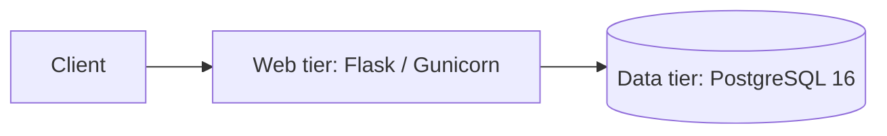

# Project 1 — Two-Tier Flask

Original two-tier web application: **Flask** (web) + **PostgreSQL 16** (data).

**Author:** [Yashas Suresh](https://github.com/yashassuresh775)

## Architecture



## Requirements

- Docker and Docker Compose

## Run with Docker Compose

```bash
cp .env.example .env
docker compose up --build
```

Open [http://localhost:5000](http://localhost:5000) for the health HTML page.

## API examples

Health check:

```bash
curl -s http://localhost:5000/api/health
```

List messages:

```bash
curl -s http://localhost:5000/api/messages
```

Create a message:

```bash
curl -s -X POST http://localhost:5000/api/messages \
  -H 'Content-Type: application/json' \
  -d '{"text":"hello from Project 1"}'
```

## License

MIT — see [LICENSE](LICENSE).
